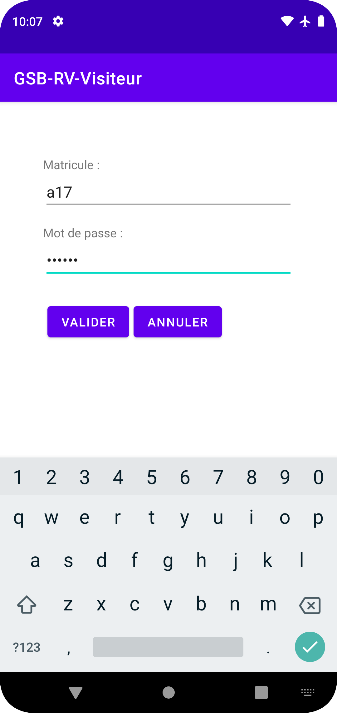

GSB RV Visiteur [](https://github.com/Aaldn/GSB-RV-Visiteur/blob/master/LICENSE.md)
========================

GSB Rapports Visite - module Visiteur – par [@Aaldn](https://github.com/Aaldn)

[](https://openjdk.java.net/) [](https://gradle.org/)

Application de saisie des rapports de visite.

<div></img>  </img></div>

### Documentation

  * [Documentation utilisateur](docs/Documentation-Utilisateur.pdf) _(À venir)_
  * [Documentation technique](docs/Documentation-Technique.pdf) _(À venir)_

### Contexte

1. [GSB - Fiche descriptive](docs/01-GSB-AppliRV-FicheDescriptive.pdf)
2. [GSB - Cas d'utilisation](docs/02-GSB-AppliRV-Visiteur-UC.pdf)
3. [GSB - Modèle Entité-Association](docs/03-GSB-AppliRV-MEA.pdf) _(À venir)_
4. [GSB - Diagramme de navigation](docs/04-GSB-AppliRV-Navigation.pdf)
5. [GSB - Documentation API / Arborescence](docs/05-GSB-AppliRV-Documentation-API.pdf)

### Prérequis

  * [Android Studio](https://developer.android.com/studio/) + création d'un [terminal virtuel](https://developer.android.com/studio/run/managing-avds) (API 28 Android 9.0 Pie !)
  * [GSB-RV-Visiteur-Serveur](https://github.com/Aaldn/GSB-RV-Visiteur-Serveur)

> En cas de difficulté, reportez-vous à la documentation officielle d'[Android Studio](https://developer.android.com/docs).

## Installation

_Rappel :_ cette application dépend du projet [GSB-RV-Visiteur-Serveur](https://github.com/Aaldn/GSB-RV-Visiteur-Serveur). Avant de poursuivre, assurez-vous de l'avoir correctement installé.

1. Positionnez-vous au sein du répertoire créé lors de l'installation du projet [GSB-RV-Visiteur-Serveur](https://github.com/Aaldn/GSB-RV-Visiteur-Serveur), puis clonez ce dépôt : 

```bash
$ cd AppliRV
$ git clone https://github.com/Aaldn/GSB-RV-Visiteur
```

2. Créez un lien vers le certificat SSL du projet [GSB-RV-Visiteur-Serveur](https://github.com/Aaldn/GSB-RV-Visiteur-Serveur) dans ce projet :

```bash
$ mkdir -p GSB-RV-Visiteur/app/src/main/res/raw
$ ln GSB-RV-Visiteur-Serveur/certificate/cert.pem GSB-RV-Visiteur/app/src/main/res/raw/
```

Vous pouvez maintenant [lancer votre application](https://developer.android.com/training/basics/firstapp/running-app) depuis Android Studio.

## Licence

Voir le fichier [LICENSE.md](https://github.com/Aaldn/GSB-RV-Visiteur/blob/master/LICENSE.md) fourni.
